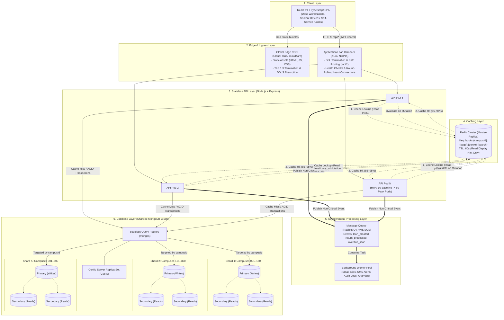

# ShelfLife — System Design for University-Scale Deployment

> **Examination Coursework**: Full Stack Web Development IA2 — Question 3 (10 Marks)  
> **System**: ShelfLife College Library Management System  
> **Context**: Multi-campus university adoption across 500 campus libraries and 2,000,000 enrolled members with 10× semester peak traffic.

---

## 1. Problem & Scale Assumptions

To design a robust, realistic production architecture, we derive quantitative engineering assumptions based on the university network specifications:

| Parameter | Scale Specification | Architectural Implication |
| :--- | :--- | :--- |
| **Campuses** | 500 autonomous campus libraries | Multi-tenant logical isolation; campus-localized physical inventory. |
| **Members** | 2,000,000 students, researchers, faculty | High-cardinality identity and history lookups. |
| **Book Catalog** | ~20,000 titles/campus (~10,000,000 total book records) | Catalog read indexing and memory-resident working sets. |
| **Active Loans** | ~2 loans/member (~4,000,000 concurrent active records) | High concurrency on loan creation and return workflows. |
| **Historical Data** | ~20,000,000 historical records (3-year rolling) | Sharded storage and secondary index segregation. |
| **Baseline Traffic** | ~15 QPS catalog reads, ~2 write TPS (12-hour operational day) | Low baseline footprint; over-provisioning would be cost-prohibitive. |
| **10× Semester Spike** | **~150 QPS average (peak 1,000–1,500 QPS reads)**<br/>**~20 TPS average (peak 150–250 TPS writes)** | Elastic horizontal autoscaling, in-memory caching, queue decoupling. |
| **Read-to-Write Ratio**| ~8:1 to 10:1 (dominated by textbook search and availability checks) | Read offloading via Redis and database read replicas. |

---

## 2. High-Level Architecture (Exam Sub-question a)

The architecture extends the existing ShelfLife **Node.js/Express** backend and **React/TypeScript** frontend into a horizontally scalable, fault-tolerant cloud deployment.



### Architectural Tier Responsibilities

1. **Client Layer**: The existing ShelfLife React 19 + TypeScript SPA. Communicates strictly over HTTPS with standard JWT bearer tokens (`Authorization: Bearer <token>`). No client state requires sticky sessions.
2. **CDN / Edge Tier**: Global CDN (AWS CloudFront / Cloudflare) caches and distributes immutable static frontend bundles (Vite build outputs, fonts, images). Absorbs 100% of static asset bandwidth, offloading origin servers.
3. **Application Load Balancer (ALB)**: Dual-redundant Layer 7 reverse proxy (AWS ALB or NGINX). Terminates TLS 1.3, routes `/api/*` traffic to API pods using round-robin or least-connections, enforces rate limiting (preventing bot scraping), and conducts active health checks (`GET /api/health`).
4. **Stateless API Cluster (Node.js + Express)**: Modular monolithic Express instances running in containerized pods (Kubernetes / AWS ECS). API nodes remain **strictly stateless**: authentication is validated cryptographically via JWT secrets without local session state. Enables horizontal scaling from 10 pods during normal operations to 80+ pods during semester rush.
5. **Caching Layer (Redis Cluster)**: In-memory distributed cache holding paginated book catalog queries. Operates in a **cache-aside** pattern. Offloads 85–95% of catalog browse read volume. **Critical Invariant**: Redis is strictly a *display hint* and is *never* authoritative for stock availability.
6. **Message Queue & Background Workers**: RabbitMQ or AWS SQS with dedicated worker nodes. Decouples non-blocking side effects (transaction email receipts, overdue push notices, audit trail logging, circulation analytics) from the synchronous HTTP request-response cycle.
7. **Authoritative Database (Sharded MongoDB Cluster)**: A sharded deployment orchestrated by `mongos` query routers and a 3-node Config Server Replica Set (CSRS). Shard data nodes are organized as 3-member replica sets (1 Primary, 2 Secondaries) ensuring zero single-point-of-failure and local read scaling.

---

## 3. MongoDB Scaling & Sharding Strategy (Exam Sub-question b)

### Cluster Architecture Decision: Shard the MongoDB Cluster

While a modern server with 128 GB RAM could physically store 50 GB of library data, **a single MongoDB cluster replica set cannot satisfy the operational concurrency requirements of 500 campus libraries under peak load**.

* **The Primary Write Bottleneck**: In a standard replica set, **only one Primary node accepts write operations**. During the semester opening week, 500 physical campus counters and thousands of student kiosks generate 150–250 concurrent write transactions per second (stock decrements, loan record insertions, returns). A single primary experiences WiredTiger write ticket exhaustion, lock contention on hot catalog indexes, and connection pool saturation.
* **Working Set & Buffer Cache**: Sharding distributes RAM buffer caches across independent machines, ensuring index working sets for 10 million books and 20 million borrow records remain memory-resident.
* **Failure Blast Radius**: Sharding confines hardware degradation or localized maintenance to a fraction of campuses rather than bringing down the entire university system.

### Shard Key Proposal & Justification

```
Collection: Book          --> Compound Shard Key: { campusId: 1, _id: 1 }
Collection: BorrowRecord  --> Compound Shard Key: { campusId: 1, member: 1 }
```

#### Evaluation of Alternative Candidate Keys:

| Candidate Key | Strengths | Severe Architectural Weaknesses | Verdict |
| :--- | :--- | :--- | :--- |
| **`_id` or `bookId` alone** (Hashed) | Perfect uniform chunk write distribution across all shards. | **Scatter-Gather Overhead**: 99% of student catalog queries filter by their local campus. A global `_id` hash scatters a single campus's books across all shards, forcing `mongos` to execute an expensive scatter-gather query across every shard for simple catalog searches. | ❌ Rejected |
| **`memberId` alone** | Groups student records together. | Separates `Book` inventory from `BorrowRecord` data, forcing every book checkout to execute a distributed cross-shard two-phase commit transaction (2PC). | ❌ Rejected |
| **`campusId` alone** | Colocates campus data locally. | **Jumbo Chunks & Hotspotting**: `campusId` has low cardinality (only 500 unique values). A flagship campus with 25,000 students would generate chunks exceeding the maximum 64 MB chunk size that MongoDB cannot split, creating severe storage hotspots. | ❌ Rejected |
| **`{ campusId: 1, _id: 1 }` (Book)**<br/>**`{ campusId: 1, member: 1 }` (BorrowRecord)** | **Targeted Routing + High Cardinality**: Prefix `campusId` guarantees targeted single-shard queries. Suffix `_id` / `member` provides monotonic uniqueness, high cardinality, and allows chunks to split and balance cleanly. | Intra-campus data is colocated on the same shard replica set, allowing multi-document transactions to commit locally without distributed two-phase commit overhead. | ✅ **Selected** |

---

## 4. Read-Heavy Operation & Redis Caching (Exam Sub-question c)

### The Single Most Read-Heavy Operation: `GET /api/books` (Catalog Search & Browse)

During semester orientation, millions of students concurrently browse assigned course reading lists, filter by subject genre, and search titles. Catalog reads outnumber write checkouts by ~10:1.

### Cache Strategy & Key Formulation

The cache stores serialized JSON response payloads of paginated catalog results (including pagination metadata). The cache key incorporates all query parameters:

```
Pattern:  books:{campusId}:{page}:{limit}:{genre}:{searchHash}
Example:  books:campus_108:1:10:Technology:a7f9c2d1
```

* `searchHash`: MD5/SHA-256 hash of the normalized search string (to handle variable-length queries cleanly).
* Fallback: If `campusId` is omitted (global university cross-campus search), key defaults to `books:global:{page}:{limit}:{genre}:{searchHash}`.

### Time-To-Live (TTL)

* **Designated TTL: 60 seconds** (bounded in the 30–120s operational window).
* *Engineering Justification*: A 60-second TTL bounds the maximum window that a book's display counter can deviate if an invalidation event is delayed, while successfully absorbing 85–95% of repeated read bursts during peak classroom syllabus announcements.

### Cache Invalidation Triggers

A hybrid **Cache-Aside with Event-Driven Invalidation** approach is employed:

```
[ POST /api/books ] --------+
[ PUT /api/books/:id ] -----+---> [ Invalidation Handler ] ---> DEL books:{campusId}:*
[ POST /api/borrow ] -------+                                  (or bump campus_catalog_version)
[ POST /api/return ] -------+
```

1. **Catalog Mutations (`POST /api/books`, metadata updates)**: Triggers immediate invalidation of the corresponding campus cache namespace `books:{campusId}:*` via Redis pattern deletion or atomic version key increment (`INCR catalog_version:{campusId}`).
2. **Inventory Updates (`POST /api/borrow`, `POST /api/return`)**: The API issues an invalidation event for the affected book's campus.
3. **Display vs. Authoritative Invariant**: Cached `availableCopies` in `GET /api/books` is strictly treated as a **UI display hint**. The frontend displays *"Available (3 copies)"*, but the backend **never** authorizes an issuance based on Redis cache data. Authoritative inventory verification is deferred entirely to the atomic database transaction.

---

## 5. Concurrent Issue-Book Consistency (Exam Sub-question d)

### The Core Invariant
`Book.availableCopies >= 0` must strictly hold at all times under extreme concurrency. If 50 students attempt to borrow the last remaining copy of a required textbook at the exact same millisecond, **exactly 1 student must succeed, and 49 must cleanly receive HTTP 400 Out of Stock**.

### Selected Primary Mechanism: Atomic Conditional Database Update within a Session Transaction

The primary mechanism is MongoDB's native atomic conditional update (`findOneAndUpdate` with `$inc: -1` and `$gt: 0`) executed within a multi-document ACID transaction:

```javascript
// Authoritative, concurrency-safe checkout implementation
const issueBook = async (req, res, next) => {
  const { bookId, memberId, dueDate, campusId } = req.body;
  const session = await mongoose.startSession();
  session.startTransaction();

  try {
    // 1. Atomic conditional decrement: Only succeeds if availableCopies > 0
    const updatedBook = await Book.findOneAndUpdate(
      {
        _id: bookId,
        campusId: campusId,
        availableCopies: { $gt: 0 }
      },
      {
        $inc: { availableCopies: -1 }
      },
      { new: true, session }
    );

    // 2. If updatedBook is null, condition failed -> stock was 0 at execution
    if (!updatedBook) {
      await session.abortTransaction();
      return res.status(400).json({
        success: false,
        message: 'No copies available for this book to borrow'
      });
    }

    // 3. Atomically record the loan in the same transaction
    const [borrowRecord] = await BorrowRecord.create(
      [{
        book: bookId,
        member: memberId,
        campusId: campusId,
        issueDate: new Date(),
        dueDate: new Date(dueDate),
        status: 'issued'
      }],
      { session }
    );

    await session.commitTransaction();

    // 4. Enqueue non-critical notifications asynchronously
    messageQueue.publish('loan_created', { borrowId: borrowRecord._id });

    return res.status(201).json({ success: true, data: borrowRecord });
  } catch (error) {
    await session.abortTransaction();
    next(error);
  } finally {
    session.endSession();
  }
};
```

### Why This Strictly Prevents Negative Stock

1. **Storage Engine Serialization**: MongoDB's WiredTiger storage engine enforces document-level exclusive write locks during document updates.
2. **Predicate Atomicity**: The query predicate `{ availableCopies: { $gt: 0 } }` is evaluated under the document write lock immediately prior to applying `$inc: -1`.
3. **Deterministic Race Resolution**:
   - When 50 concurrent requests target a book with `availableCopies: 1`, the 50 threads queue on the document lock.
   - **Thread 1** acquires the lock: `availableCopies` is 1 (`1 > 0` is `true`). It decrements `availableCopies` to 0, updates the document, and releases the lock.
   - **Threads 2 through 50** acquire the lock sequentially: `availableCopies` is now 0 (`0 > 0` is `false`). The query criteria matches 0 documents. MongoDB returns `null`.
   - The API inspects `updatedBook === null`, immediately aborts the transaction, and returns a clean HTTP 400 error.
   - Under no sequence of interleaving can `availableCopies` ever transition below 0.

### Comparative Analysis: Why Atomic Conditional Update is Superior to Alternatives

```
┌─────────────────────────────────┬────────────────────────────────────────────────────────────────────────┐
│ Alternative Mechanism           │ Reason for Rejection in Favor of Atomic Conditional Update             │
├─────────────────────────────────┼────────────────────────────────────────────────────────────────────────┤
│ 1. Optimistic Locking (__v)     │ High Abort Storms: 50 requests read version v1. The first write        │
│                                 │ commits to v2; the other 49 fail with VersionError. Even if 5 copies   │
│                                 │ were available, 45 valid requests would fail unless complex, latency-  │
│                                 │ intensive retry loops are implemented. Atomic update succeeds directly.│
├─────────────────────────────────┼────────────────────────────────────────────────────────────────────────┤
│ 2. Distributed Lock (Redlock)   │ Network Overhead & Split-Brain Risks: Adds 2–5ms network latency per   │
│                                 │ loan; vulnerable to process pauses (GC pause) where lock TTL expires,  │
│                                 │ allowing two nodes to hold the lock simultaneously. Adds Redis as a    │
│                                 │ hard failure dependency for database consistency.                      │
├─────────────────────────────────┼────────────────────────────────────────────────────────────────────────┤
│ 3. Queued Asynchronous Checkout │ Poor User Experience: Checkouts at physical front desks require        │
│                                 │ immediate synchronous confirmation. Queuing forces asynchronous polling│
│                                 │ (HTTP 202 Accepted); if out of stock, student has already left desk.   │
└─────────────────────────────────┴────────────────────────────────────────────────────────────────────────┘
```

---

## 6. Handling 10× Semester Traffic Spike (Exam Sub-question e)

To handle the 10× semester surge without paying for idle capacity throughout the remaining 40 weeks of the academic year, ShelfLife utilizes an **elastic, multi-tiered demand-absorption strategy**:

```
[ 10× Traffic Surge ]
        │
        ├──> Edge Tier (CDN)          ──> Absorbs 100% of static asset bandwidth
        │
        ├──> Cache Tier (Redis)       ──> Absorbs 85–95% of catalog search read volume
        │
        ├──> API Tier (HPA Autoscaling)─> Dynamically scales stateless pods (10 -> 80)
        │
        ├──> DB Tier (Read Replicas)  ──> Offloads history/reporting reads from Primaries
        │
        └──> Async Tier (Queue)       ──> Absorbs slow side-effects (emails, audit logs)
```

1. **Horizontal Pod Autoscaling (HPA) of Stateless API Nodes**:
   - The Express API servers maintain **zero in-memory session state** (JWT authentication).
   - Kubernetes / AWS ECS HPA automatically scales API pods based on dual metrics: CPU utilization (> 70%) and HTTP request queue length.
   - **Baseline**: 10 pods handle the normal ~15 QPS.
   - **Semester Peak**: Automatically scales up to 80 pods to handle peak 1,500 QPS.
   - **Scale-Down Stabilization**: A 15-minute cooldown window prevents thrashing (rapid scale-up/down oscillations).
2. **Aggressive In-Memory Read Offloading via Redis**:
   - 90% of semester spike volume is repetitive syllabus browsing and ISBN lookups.
   - With a 60-second TTL, Redis Cluster absorbs ~90% of `GET /api/books` requests.
   - The sharded database cluster only receives ~150 cache-miss QPS rather than the raw 1,500 QPS.
3. **Database Read Replica Segregation**:
   - MongoDB replica sets configure `readPreference: 'secondaryPreferred'` for read-intensive, non-transactional endpoints (e.g., student loan history `GET /api/members/:id/history` and admin circulation reports).
   - Isolates Primary replica nodes so their compute and IOPS are 100% dedicated to processing critical `issueBook` and `returnBook` write transactions.
4. **Asynchronous Queue Decoupling**:
   - Checkout HTTP responses complete immediately after the database commit (< 25ms).
   - Slow downstream tasks (sending email loan receipts, updating historical analytics counters, generating audit log entries) are published to RabbitMQ / AWS SQS and processed by asynchronous workers, preventing event loop blocking.

---

## 7. Failure Handling & Reliability

| Failure Scenario | Mitigation & System Behavior |
| :--- | :--- |
| **Redis Cluster Outage** | **Graceful Cache Bypass**: The API client wraps Redis calls in try-catch with a circuit breaker. On cache connection failure, the API logs the degradation and falls back directly to querying MongoDB read replicas. Response latency increases by ~15ms, but zero transactions fail. |
| **API Node Crash** | **Zero-Downtime Re-routing**: Load balancer health checks (`/api/health`) detect failure within 5 seconds and stop dispatching traffic to the unhealthy pod. Because API nodes are completely stateless, in-flight requests from other users are unaffected. |
| **MongoDB Primary Node Failure** | **Automated Replica Set Election**: Secondaries conduct a Raft-based election and promote a new Primary within < 3 seconds. The Mongoose driver utilizes `retryWrites=true` to automatically buffer and retry idempotent transactions without returning 500 errors to clients. |
| **Message Queue Downtime** | **Transactional Outbox / Resilient Spooling**: Non-critical notification failures do not roll back the primary library loan transaction. Failed messages are written to a localized outbox collection and retried with exponential backoff once the queue recovers. |

---

## 8. Key Architectural Trade-offs

| Design Decision | Chosen Approach | Alternative Considered | Primary Justification |
| :--- | :--- | :--- | :--- |
| **Database Architecture** | Sharded MongoDB Cluster | Single Replica Set Cluster | Eliminates single-primary write bottleneck and IOPS saturation across 500 campuses during semester rush. |
| **Sharding Key** | Compound `{ campusId: 1, _id: 1 }` | Global Hashed `{ _id: "hashed" }` | Guarantees targeted single-shard queries for 99% of campus-scoped searches while preventing jumbo chunk lockup. |
| **Concurrency Control**| Atomic Conditional Decrement | Distributed Lock (Redlock) | Eliminates external locking latency and split-brain expiration failure modes; utilizes native storage engine locks. |
| **Catalog Availability**| Redis Cache as Display Hint | Redis as Authoritative Stock Counter | Prevents inventory drift and split-brain overselling; MongoDB remains the single source of truth for stock. |
| **Service Granularity** | Horizontally Scaled Modular Monolith | Microservices Architecture | Avoids distributed network latency, cross-service saga orchestration, and operational complexity for an academic platform. |

---

## 9. Final Architecture Summary

The ShelfLife university-scale system design preserves the core modular principles of the existing **Q1 Express/MongoDB backend** and **Q2 React/TypeScript frontend** while providing linear horizontal scalability:

1. **Stateless Compute**: API instances scale dynamically from 10 to 80 pods to absorb the 10× semester peak without year-round infrastructure over-provisioning.
2. **Sub-second Catalog Reads**: Redis Cluster and CDN edge caching offload > 90% of traffic, guaranteeing fast book search response times.
3. **Strict Inventory Safety**: Atomic conditional database updates (`findOneAndUpdate` with `{ availableCopies: { $gt: 0 } }`) coupled with MongoDB multi-document transactions mathematically guarantee that `availableCopies` never becomes negative.
4. **Targeted Sharding**: Compound keys `{ campusId: 1, _id: 1 }` colocate campus inventory on dedicated shard replica sets, avoiding scatter-gather query overhead while distributing write throughput evenly across the university network.
